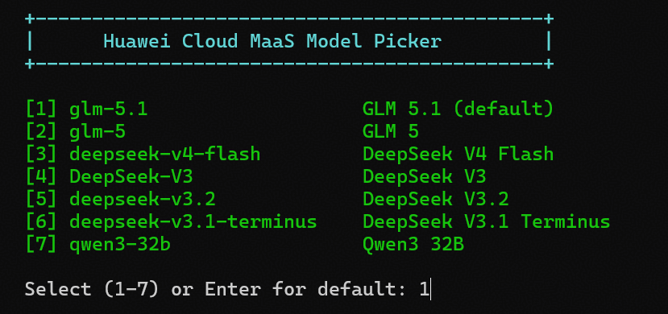
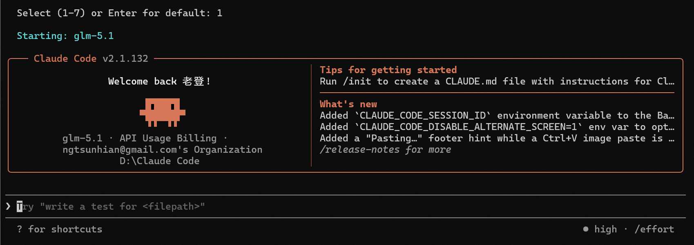

# Claude Code Multi-Provider Model Switching

[English](#english) | [中文](#chinese)

---

<a id="english"></a>

## English

### Problem

When using Claude Code with a third-party API proxy (e.g. Huawei Cloud MaaS), you face these pain points:

1. **No model switching** - `/model` inside Claude Code only shows Anthropic official models. Custom models (GLM, DeepSeek, Qwen) are invisible and cannot be selected.
2. **Manual config editing** - Switching between Anthropic official and proxy providers requires manually editing `~/.claude/settings.json` each time (changing `ANTHROPIC_BASE_URL`, `ANTHROPIC_AUTH_TOKEN`, `ANTHROPIC_MODEL`), which is error-prone and tedious.
3. **No model discovery** - You have to remember or look up available model names on the proxy platform; there's no interactive picker.
4. **Config pollution** - Putting proxy settings in `settings.json` makes them persistent, so `claude` always hits the proxy even when you want Anthropic official models.

### Solution

This guide provides a `claude-huaweicloud` shell function that:

- **Interactive model picker** - Numbered menu with all available models, no need to memorize IDs
- **Direct model selection** - `claude-huaweicloud -Model deepseek-v4-flash` for quick launch
- **Tab completion** - Type a prefix and press Tab to complete model names
- **Clean separation** - Proxy settings are injected at runtime only, never written to `settings.json`. `claude` always uses Anthropic official; `claude-huaweicloud` always uses the proxy.
- **Cross-platform** - Works on Windows (PowerShell), macOS (Zsh), and Linux (Bash)
- **Full CLI flag support** - All `claude` CLI startup flags (like `--dangerously-skip-permissions`, `--continue`, `--print`, `--permission-mode`, etc.) are exposed as PowerShell parameters with Tab completion

### Overview

Two entry points for Claude Code with different model providers:

| Command | Provider | Models |
|---------|----------|--------|
| `claude` | Anthropic Official (Pro) | Sonnet 4.6, Haiku 4.5 |
| `claude-huaweicloud` | Huawei Cloud MaaS | GLM, DeepSeek, Qwen |

### Anthropic Official Models (Pro Subscription)

| Model ID | Description | Context Window |
|----------|-------------|----------------|
| `claude-sonnet-4-6` | Best balance of speed and intelligence | 1M tokens |
| `claude-haiku-4-5` | Fastest, near-frontier intelligence | 200K tokens |

> Opus models require Max subscription.

### Huawei Cloud MaaS Models (Hong Kong Region)

| Model ID | Provider | Description |
|----------|----------|-------------|
| `glm-5.1` | Zhipu AI | GLM 5.1 (default) |
| `glm-5` | Zhipu AI | GLM 5 |
| `deepseek-v4-flash` | DeepSeek | V4 Flash |
| `DeepSeek-V3` | DeepSeek | V3 |
| `deepseek-v3.2` | DeepSeek | V3.2 |
| `deepseek-v3.1-terminus` | DeepSeek | V3.1 Terminus |
| `qwen3-32b` | Alibaba | Qwen3 32B |

### Usage

#### Anthropic Official

```bash
# Default (Sonnet 4.6)
claude

# Specific model
claude --model claude-haiku-4-5
```

#### Huawei Cloud MaaS - Interactive Picker

```bash
claude-huaweicloud
```



Output:

```
  +---------------------------------------------+
  |      Huawei Cloud MaaS Model Picker         |
  +---------------------------------------------+

  [1] glm-5.1                  GLM 5.1 (default)
  [2] glm-5                    GLM 5
  [3] deepseek-v4-flash        DeepSeek V4 Flash
  [4] DeepSeek-V3              DeepSeek V3
  [5] deepseek-v3.2            DeepSeek V3.2
  [6] deepseek-v3.1-terminus   DeepSeek V3.1 Terminus
  [7] qwen3-32b                Qwen3 32B

  Select (1-7) or Enter for default:
```



#### Huawei Cloud MaaS - Direct

```bash
# Specify model directly
claude-huaweicloud -Model deepseek-v4-flash
claude-huaweicloud -Model qwen3-32b

# Tab completion (PowerShell / Bash)
claude-huaweicloud -Model deep<Tab>
```

#### Huawei Cloud MaaS - CLI Flags

```powershell
# Skip permission checks
claude-huaweicloud -DangerouslySkipPermissions

# Continue last session
claude-huaweicloud -Continue

# Non-interactive with permission bypass
claude-huaweicloud -Model deepseek-v4-flash -Print -PermissionMode bypassPermissions

# Resume a session
claude-huaweicloud -Resume  # interactive picker
claude-huaweicloud -Resume "session-id"  # specific session

# Combine flags
claude-huaweicloud -Model glm-5 -DangerouslySkipPermissions -Continue -VerboseFlag
```

### Supported CLI Flags

#### Switch Flags (no value needed)

| PowerShell Parameter | `claude` CLI Flag |
|----------------------|-------------------|
| `-DangerouslySkipPermissions` | `--dangerously-skip-permissions` |
| `-Continue` | `--continue` |
| `-Print` | `--print` |
| `-VerboseFlag` | `--verbose` |
| `-DebugFlag` | `--debug` |
| `-Bare` | `--bare` |
| `-Ide` | `--ide` |
| `-Chrome` | `--chrome` |
| `-NoChrome` | `--no-chrome` |
| `-ForkSession` | `--fork-session` |
| `-DisableSlashCommands` | `--disable-slash-commands` |
| `-StrictMcpConfig` | `--strict-mcp-config` |
| `-NoSessionPersistence` | `--no-session-persistence` |
| `-IncludeHookEvents` | `--include-hook-events` |
| `-IncludePartialMessages` | `--include-partial-messages` |
| `-ReplayUserMessages` | `--replay-user-messages` |
| `-ExcludeDynamicSystemPromptSections` | `--exclude-dynamic-system-prompt-sections` |
| `-Brief` | `--brief` |
| `-AllowDangerouslySkipPermissions` | `--allow-dangerously-skip-permissions` |

#### String Flags (value required)

| PowerShell Parameter | `claude` CLI Flag | Valid Values |
|----------------------|-------------------|--------------|
| `-AddDir` | `--add-dir` | directory path |
| `-Agent` | `--agent` | agent name |
| `-Agents` | `--agents` | agent names |
| `-AllowedTools` | `--allowedTools` | tool list |
| `-AppendSystemPrompt` | `--append-system-prompt` | prompt text |
| `-AppendSystemPromptFile` | `--append-system-prompt-file` | file path |
| `-Betas` | `--betas` | beta features |
| `-DisallowedTools` | `--disallowedTools` | tool list |
| `-Effort` | `--effort` | `low`, `medium`, `high`, `xhigh`, `max` |
| `-FallbackModel` | `--fallback-model` | model ID |
| `-File` | `--file` | file path |
| `-FromPr` | `--from-pr` | PR reference |
| `-InputFormat` | `--input-format` | `text`, `stream-json` |
| `-JsonSchema` | `--json-schema` | schema |
| `-MaxBudgetUsd` | `--max-budget-usd` | dollar amount |
| `-McpConfig` | `--mcp-config` | config path |
| `-Name` | `--name` | session name |
| `-OutputFormat` | `--output-format` | `text`, `json`, `stream-json` |
| `-PermissionMode` | `--permission-mode` | `acceptEdits`, `auto`, `bypassPermissions`, `default`, `dontAsk`, `plan` |
| `-PluginDir` | `--plugin-dir` | directory path |
| `-PluginUrl` | `--plugin-url` | URL |
| `-Resume` | `--resume` | session ID (or omit for picker) |
| `-SessionId` | `--session-id` | session ID |
| `-SettingSources` | `--setting-sources` | sources |
| `-Settings` | `--settings` | settings path |
| `-SystemPrompt` | `--system-prompt` | prompt text |
| `-SystemPromptFile` | `--system-prompt-file` | file path |
| `-Tools` | `--tools` | tool list |
| `-Worktree` | `--worktree` | name (or omit for default) |
| `-DebugFile` | `--debug-file` | file path |
| `-RemoteControl` | `--remote-control` | config (or omit for default) |
| `-RemoteControlSessionNamePrefix` | `--remote-control-session-name-prefix` | prefix |
| `-Tmux` | `--tmux` | (any value enables the flag) |

### Limitations

- `/model` inside Claude Code only shows Anthropic official models
- Switching models requires restarting the session
- Pro subscription does not include Opus models

---

### Configuration

Replace the placeholders below with your actual values:

- `<YOUR_TOKEN>` - Huawei Cloud MaaS API token
- `<YOUR_BASE_URL>` - MaaS API endpoint, e.g. `https://api-ap-southeast-1.modelarts-maas.com/anthropic`

#### Windows (PowerShell)

Edit PowerShell profile:

```powershell
notepad $PROFILE
```

Add the following content:

```powershell
function claude-huaweicloud {
    param(
        [string]$Model = "",
        # --- Switch flags ---
        [switch]$DangerouslySkipPermissions,
        [switch]$Continue,
        [switch]$Print,
        [switch]$VerboseFlag,
        [switch]$DebugFlag,
        [switch]$Bare,
        [switch]$Ide,
        [switch]$Chrome,
        [switch]$NoChrome,
        [switch]$ForkSession,
        [switch]$DisableSlashCommands,
        [switch]$StrictMcpConfig,
        [switch]$NoSessionPersistence,
        [switch]$IncludeHookEvents,
        [switch]$IncludePartialMessages,
        [switch]$ReplayUserMessages,
        [switch]$ExcludeDynamicSystemPromptSections,
        [switch]$Brief,
        [switch]$AllowDangerouslySkipPermissions,
        # --- String flags ---
        [string]$AddDir,
        [string]$Agent,
        [string]$Agents,
        [string]$AllowedTools,
        [string]$AppendSystemPrompt,
        [string]$AppendSystemPromptFile,
        [string]$Betas,
        [string]$DisallowedTools,
        [ValidateSet("low","medium","high","xhigh","max")][string]$Effort,
        [string]$FallbackModel,
        [string]$File,
        [string]$FromPr,
        [ValidateSet("text","stream-json")][string]$InputFormat,
        [string]$JsonSchema,
        [string]$MaxBudgetUsd,
        [string]$McpConfig,
        [string]$Name,
        [ValidateSet("text","json","stream-json")][string]$OutputFormat,
        [ValidateSet("acceptEdits","auto","bypassPermissions","default","dontAsk","plan")][string]$PermissionMode,
        [string]$PluginDir,
        [string]$PluginUrl,
        [string]$Resume,
        [string]$SessionId,
        [string]$SettingSources,
        [string]$Settings,
        [string]$SystemPrompt,
        [string]$SystemPromptFile,
        [string]$Tools,
        [string]$Worktree,
        [string]$DebugFile,
        [string]$RemoteControl,
        [string]$RemoteControlSessionNamePrefix,
        [string]$Tmux
    )
    $hwToken = "<YOUR_TOKEN>"
    $hwUrl = "<YOUR_BASE_URL>"
    $hwModels = @(
        @{id="glm-5.1";              desc="GLM 5.1 (default)"},
        @{id="glm-5";                desc="GLM 5"},
        @{id="deepseek-v4-flash";    desc="DeepSeek V4 Flash"},
        @{id="DeepSeek-V3";          desc="DeepSeek V3"},
        @{id="deepseek-v3.2";        desc="DeepSeek V3.2"},
        @{id="deepseek-v3.1-terminus"; desc="DeepSeek V3.1 Terminus"},
        @{id="qwen3-32b";            desc="Qwen3 32B"}
    )
    if ($Model -eq "") {
        Write-Host ""
        Write-Host "  +---------------------------------------------+" -ForegroundColor Cyan
        Write-Host "  |      Huawei Cloud MaaS Model Picker         |" -ForegroundColor Cyan
        Write-Host "  +---------------------------------------------+" -ForegroundColor Cyan
        Write-Host ""
        for ($i = 0; $i -lt $hwModels.Count; $i++) {
            Write-Host ("  {0,-3} {1,-25} {2}" -f "[$($i+1)]", $hwModels[$i].id, $hwModels[$i].desc) -ForegroundColor Green
        }
        Write-Host ""
        $choice = Read-Host "  Select (1-$($hwModels.Count)) or Enter for default"
        if ($choice -match '^\d+$' -and [int]$choice -ge 1 -and [int]$choice -le $hwModels.Count) {
            $Model = $hwModels[[int]$choice - 1].id
        } else {
            $Model = "glm-5.1"
        }
        Write-Host ""
        Write-Host "  Starting: $Model" -ForegroundColor Cyan
        Write-Host ""
    }
    # Build claude arguments
    $claudeArgs = [System.Collections.ArrayList]::new()
    $claudeArgs.AddRange(@("--model", $Model))
    # Switch flags
    if ($DangerouslySkipPermissions)   { $claudeArgs.Add("--dangerously-skip-permissions") | Out-Null }
    if ($Continue)                     { $claudeArgs.Add("--continue") | Out-Null }
    if ($Print)                        { $claudeArgs.Add("--print") | Out-Null }
    if ($VerboseFlag)                  { $claudeArgs.Add("--verbose") | Out-Null }
    if ($DebugFlag)                    { $claudeArgs.Add("--debug") | Out-Null }
    if ($Bare)                         { $claudeArgs.Add("--bare") | Out-Null }
    if ($Ide)                          { $claudeArgs.Add("--ide") | Out-Null }
    if ($Chrome)                       { $claudeArgs.Add("--chrome") | Out-Null }
    if ($NoChrome)                     { $claudeArgs.Add("--no-chrome") | Out-Null }
    if ($ForkSession)                  { $claudeArgs.Add("--fork-session") | Out-Null }
    if ($DisableSlashCommands)         { $claudeArgs.Add("--disable-slash-commands") | Out-Null }
    if ($StrictMcpConfig)             { $claudeArgs.Add("--strict-mcp-config") | Out-Null }
    if ($NoSessionPersistence)         { $claudeArgs.Add("--no-session-persistence") | Out-Null }
    if ($IncludeHookEvents)            { $claudeArgs.Add("--include-hook-events") | Out-Null }
    if ($IncludePartialMessages)       { $claudeArgs.Add("--include-partial-messages") | Out-Null }
    if ($ReplayUserMessages)           { $claudeArgs.Add("--replay-user-messages") | Out-Null }
    if ($ExcludeDynamicSystemPromptSections) { $claudeArgs.Add("--exclude-dynamic-system-prompt-sections") | Out-Null }
    if ($Brief)                        { $claudeArgs.Add("--brief") | Out-Null }
    if ($AllowDangerouslySkipPermissions) { $claudeArgs.Add("--allow-dangerously-skip-permissions") | Out-Null }
    # String flags (only add if provided)
    if ($AddDir)                       { $claudeArgs.AddRange(@("--add-dir", $AddDir)) | Out-Null }
    if ($Agent)                        { $claudeArgs.AddRange(@("--agent", $Agent)) | Out-Null }
    if ($Agents)                       { $claudeArgs.AddRange(@("--agents", $Agents)) | Out-Null }
    if ($AllowedTools)                 { $claudeArgs.AddRange(@("--allowedTools", $AllowedTools)) | Out-Null }
    if ($AppendSystemPrompt)           { $claudeArgs.AddRange(@("--append-system-prompt", $AppendSystemPrompt)) | Out-Null }
    if ($AppendSystemPromptFile)       { $claudeArgs.AddRange(@("--append-system-prompt-file", $AppendSystemPromptFile)) | Out-Null }
    if ($Betas)                        { $claudeArgs.AddRange(@("--betas", $Betas)) | Out-Null }
    if ($DisallowedTools)              { $claudeArgs.AddRange(@("--disallowedTools", $DisallowedTools)) | Out-Null }
    if ($Effort)                       { $claudeArgs.AddRange(@("--effort", $Effort)) | Out-Null }
    if ($FallbackModel)                { $claudeArgs.AddRange(@("--fallback-model", $FallbackModel)) | Out-Null }
    if ($File)                         { $claudeArgs.AddRange(@("--file", $File)) | Out-Null }
    if ($FromPr)                       { $claudeArgs.AddRange(@("--from-pr", $FromPr)) | Out-Null }
    if ($InputFormat)                  { $claudeArgs.AddRange(@("--input-format", $InputFormat)) | Out-Null }
    if ($JsonSchema)                   { $claudeArgs.AddRange(@("--json-schema", $JsonSchema)) | Out-Null }
    if ($MaxBudgetUsd)                 { $claudeArgs.AddRange(@("--max-budget-usd", $MaxBudgetUsd)) | Out-Null }
    if ($McpConfig)                    { $claudeArgs.AddRange(@("--mcp-config", $McpConfig)) | Out-Null }
    if ($Name)                         { $claudeArgs.AddRange(@("--name", $Name)) | Out-Null }
    if ($OutputFormat)                 { $claudeArgs.AddRange(@("--output-format", $OutputFormat)) | Out-Null }
    if ($PermissionMode)              { $claudeArgs.AddRange(@("--permission-mode", $PermissionMode)) | Out-Null }
    if ($PluginDir)                    { $claudeArgs.AddRange(@("--plugin-dir", $PluginDir)) | Out-Null }
    if ($PluginUrl)                    { $claudeArgs.AddRange(@("--plugin-url", $PluginUrl)) | Out-Null }
    if ($PSBoundParameters.ContainsKey('Resume')) {
        if ($Resume) { $claudeArgs.AddRange(@("--resume", $Resume)) | Out-Null }
        else { $claudeArgs.Add("--resume") | Out-Null }
    }
    if ($SessionId)                    { $claudeArgs.AddRange(@("--session-id", $SessionId)) | Out-Null }
    if ($SettingSources)              { $claudeArgs.AddRange(@("--setting-sources", $SettingSources)) | Out-Null }
    if ($Settings)                     { $claudeArgs.AddRange(@("--settings", $Settings)) | Out-Null }
    if ($SystemPrompt)                 { $claudeArgs.AddRange(@("--system-prompt", $SystemPrompt)) | Out-Null }
    if ($SystemPromptFile)             { $claudeArgs.AddRange(@("--system-prompt-file", $SystemPromptFile)) | Out-Null }
    if ($Tools)                        { $claudeArgs.AddRange(@("--tools", $Tools)) | Out-Null }
    if ($PSBoundParameters.ContainsKey('Worktree')) {
        if ($Worktree) { $claudeArgs.AddRange(@("--worktree", $Worktree)) | Out-Null }
        else { $claudeArgs.Add("--worktree") | Out-Null }
    }
    if ($DebugFile)                    { $claudeArgs.AddRange(@("--debug-file", $DebugFile)) | Out-Null }
    if ($PSBoundParameters.ContainsKey('RemoteControl')) {
        if ($RemoteControl) { $claudeArgs.AddRange(@("--remote-control", $RemoteControl)) | Out-Null }
        else { $claudeArgs.Add("--remote-control") | Out-Null }
    }
    if ($RemoteControlSessionNamePrefix) { $claudeArgs.AddRange(@("--remote-control-session-name-prefix", $RemoteControlSessionNamePrefix)) | Out-Null }
    if ($Tmux)                         { $claudeArgs.Add("--tmux") | Out-Null }
    # Append any extra passthrough args
    if ($args.Count -gt 0) { $claudeArgs.AddRange($args) | Out-Null }
    # Set env and run
    $env:ANTHROPIC_AUTH_TOKEN = $hwToken
    $env:ANTHROPIC_BASE_URL = $hwUrl
    $env:ANTHROPIC_MODEL = $Model
    claude @claudeArgs
    Remove-Item Env:ANTHROPIC_AUTH_TOKEN -ErrorAction SilentlyContinue
    Remove-Item Env:ANTHROPIC_BASE_URL -ErrorAction SilentlyContinue
    Remove-Item Env:ANTHROPIC_MODEL -ErrorAction SilentlyContinue
}
Register-ArgumentCompleter -CommandName claude-huaweicloud -ParameterName Model -ScriptBlock {
    param($commandName, $parameterName, $wordToComplete, $commandAst, $fakeBoundParameter)
    @("glm-5.1", "glm-5", "deepseek-v4-flash", "DeepSeek-V3", "deepseek-v3.2", "deepseek-v3.1-terminus", "qwen3-32b") | Where-Object { $_ -like "$wordToComplete*" } | ForEach-Object {
        [System.Management.Automation.CompletionResult]::new($_, $_, 'ParameterValue', $_)
    }
}
```

Reload in current session:

```powershell
. $PROFILE
```

#### macOS / Linux (Bash/Zsh)

Edit shell config:

```bash
# Bash
nano ~/.bashrc

# Zsh (macOS default)
nano ~/.zshrc
```

Add the following content:

```bash
claude-huaweicloud() {
    local hwToken="<YOUR_TOKEN>"
    local hwUrl="<YOUR_BASE_URL>"
    local hwModels=("glm-5.1" "glm-5" "deepseek-v4-flash" "DeepSeek-V3" "deepseek-v3.2" "deepseek-v3.1-terminus" "qwen3-32b")
    local hwDescs=("GLM 5.1 (default)" "GLM 5" "DeepSeek V4 Flash" "DeepSeek V3" "DeepSeek V3.2" "DeepSeek V3.1 Terminus" "Qwen3 32B")
    local model="${1:-}"
    if [ -z "$model" ]; then
        echo ""
        echo "  +---------------------------------------------+"
        echo "  |      Huawei Cloud MaaS Model Picker         |"
        echo "  +---------------------------------------------+"
        echo ""
        for i in "${!hwModels[@]}"; do
            printf "  [%d] %-25s %s\n" "$((i+1))" "${hwModels[$i]}" "${hwDescs[$i]}"
        done
        echo ""
        read -p "  Select (1-${#hwModels[@]}) or Enter for default: " choice
        if [[ "$choice" =~ ^[0-9]+$ ]] && [ "$choice" -ge 1 ] && [ "$choice" -le "${#hwModels[@]}" ]; then
            model="${hwModels[$((choice-1))]}"
        else
            model="glm-5.1"
        fi
        echo ""
        echo "  Starting: $model"
        echo ""
    fi
    ANTHROPIC_AUTH_TOKEN="$hwToken" \
    ANTHROPIC_BASE_URL="$hwUrl" \
    ANTHROPIC_MODEL="$model" \
    claude --model "$model"
}

# Bash tab completion
if [ -n "$BASH_VERSION" ]; then
    _claude_huaweicloud_complete() {
        local cur="${COMP_WORDS[COMP_CWORD]}"
        COMPREPLY=($(compgen -W "glm-5.1 glm-5 deepseek-v4-flash DeepSeek-V3 deepseek-v3.2 deepseek-v3.1-terminus qwen3-32b" -- "$cur"))
    }
    complete -F _claude_huaweicloud_complete claude-huaweicloud
fi

# Zsh tab completion
if [ -n "$ZSH_VERSION" ]; then
    _claude_huaweicloud_complete() {
        local -a models=("glm-5.1" "glm-5" "deepseek-v4-flash" "DeepSeek-V3" "deepseek-v3.2" "deepseek-v3.1-terminus" "qwen3-32b")
        _describe 'model' models
    }
    compdef _claude_huaweicloud_complete claude-huaweicloud
fi
```

Reload in current session:

```bash
# Bash
source ~/.bashrc

# Zsh
source ~/.zshrc
```

#### Windows (Git Bash / WSL)

Git Bash and WSL use the Bash config above. Add the same content to `~/.bashrc`.

For WSL, the file is located at `/home/<username>/.bashrc` inside the WSL filesystem.

#### Claude Code Base Settings

Ensure `~/.claude/settings.json` does NOT contain Huawei Cloud proxy settings (those are handled by the `claude-huaweicloud` function at runtime):

```json
{
  "env": {
    "PYTHON": "D:/anaconda/python.exe"
  },
  "model": "sonnet"
}
```

---

<a id="chinese"></a>

## 中文

### 痛点

使用第三方 API 代理（如华为云 MaaS）运行 Claude Code 时，会遇到以下问题：

1. **无法切换模型** - Claude Code 内的 `/model` 命令仅显示 Anthropic 官方模型，自定义模型（GLM、DeepSeek、Qwen）不可见且无法选择。
2. **手动改配置** - 在 Anthropic 官方和代理供应商之间切换，每次都要手动编辑 `~/.claude/settings.json`（修改 `ANTHROPIC_BASE_URL`、`ANTHROPIC_AUTH_TOKEN`、`ANTHROPIC_MODEL`），容易出错且繁琐。
3. **无法发现模型** - 必须记住或查阅代理平台上的可用模型名称，没有交互式选择器。
4. **配置污染** - 将代理设置写入 `settings.json` 后变为持久配置，导致 `claude` 命令也走代理，无法使用 Anthropic 官方模型。

### 解决方案

本指南提供 `claude-huaweicloud` Shell 函数，实现：

- **交互式模型选择** - 编号菜单展示所有可用模型，无需记忆模型 ID
- **直接指定模型** - `claude-huaweicloud -Model deepseek-v4-flash` 快速启动
- **Tab 补全** - 输入前缀按 Tab 自动补全模型名称
- **干净隔离** - 代理设置仅在运行时注入，不写入 `settings.json`。`claude` 始终走 Anthropic 官方；`claude-huaweicloud` 始终走代理。
- **跨平台** - 支持 Windows（PowerShell）、macOS（Zsh）、Linux（Bash）
- **完整 CLI 标志支持** - 所有 `claude` CLI 启动标志（如 `--dangerously-skip-permissions`、`--continue`、`--print`、`--permission-mode` 等）均暴露为 PowerShell 参数，并支持 Tab 补全

### 概述

两个入口，分别对应不同模型供应商：

| 命令 | 供应商 | 模型 |
|------|--------|------|
| `claude` | Anthropic 官方（Pro 订阅） | Sonnet 4.6, Haiku 4.5 |
| `claude-huaweicloud` | 华为云 MaaS | GLM, DeepSeek, Qwen |

### Anthropic 官方模型（Pro 订阅）

| 模型 ID | 说明 | 上下文窗口 |
|---------|------|-----------|
| `claude-sonnet-4-6` | 速度与智能的最佳平衡 | 1M tokens |
| `claude-haiku-4-5` | 最快，接近前沿智能 | 200K tokens |

> Opus 模型需要 Max 订阅。

### 华为云 MaaS 模型（香港区域）

| 模型 ID | 厂商 | 说明 |
|---------|------|------|
| `glm-5.1` | 智谱 AI | GLM 5.1（默认） |
| `glm-5` | 智谱 AI | GLM 5 |
| `deepseek-v4-flash` | DeepSeek | V4 Flash |
| `DeepSeek-V3` | DeepSeek | V3 |
| `deepseek-v3.2` | DeepSeek | V3.2 |
| `deepseek-v3.1-terminus` | DeepSeek | V3.1 Terminus |
| `qwen3-32b` | 阿里 | Qwen3 32B |

### 使用方式

#### Anthropic 官方

```bash
# 默认（Sonnet 4.6）
claude

# 指定模型
claude --model claude-haiku-4-5
```

#### 华为云 MaaS - 交互式选择

```bash
claude-huaweicloud
```


输出：

```
  +---------------------------------------------+
  |      Huawei Cloud MaaS Model Picker         |
  +---------------------------------------------+

  [1] glm-5.1                  GLM 5.1 (default)
  [2] glm-5                    GLM 5
  [3] deepseek-v4-flash        DeepSeek V4 Flash
  [4] DeepSeek-V3              DeepSeek V3
  [5] deepseek-v3.2            DeepSeek V3.2
  [6] deepseek-v3.1-terminus   DeepSeek V3.1 Terminus
  [7] qwen3-32b                Qwen3 32B

  Select (1-7) or Enter for default:
```


#### 华为云 MaaS - 直接指定

```bash
# 直接指定模型
claude-huaweicloud -Model deepseek-v4-flash
claude-huaweicloud -Model qwen3-32b

# Tab 补全（PowerShell / Bash / Zsh）
claude-huaweicloud -Model deep<Tab>
```

#### 华为云 MaaS - CLI 标志

```powershell
# 跳过权限检查
claude-huaweicloud -DangerouslySkipPermissions

# 继续上次会话
claude-huaweicloud -Continue

# 非交互模式并绕过权限
claude-huaweicloud -Model deepseek-v4-flash -Print -PermissionMode bypassPermissions

# 恢复会话
claude-huaweicloud -Resume  # 交互式选择器
claude-huaweicloud -Resume "session-id"  # 指定会话 ID

# 组合多个标志
claude-huaweicloud -Model glm-5 -DangerouslySkipPermissions -Continue -VerboseFlag
```

### 支持的 CLI 标志

#### 开关标志（无需值）

| PowerShell 参数 | `claude` CLI 标志 |
|-----------------|-------------------|
| `-DangerouslySkipPermissions` | `--dangerously-skip-permissions` |
| `-Continue` | `--continue` |
| `-Print` | `--print` |
| `-VerboseFlag` | `--verbose` |
| `-DebugFlag` | `--debug` |
| `-Bare` | `--bare` |
| `-Ide` | `--ide` |
| `-Chrome` | `--chrome` |
| `-NoChrome` | `--no-chrome` |
| `-ForkSession` | `--fork-session` |
| `-DisableSlashCommands` | `--disable-slash-commands` |
| `-StrictMcpConfig` | `--strict-mcp-config` |
| `-NoSessionPersistence` | `--no-session-persistence` |
| `-IncludeHookEvents` | `--include-hook-events` |
| `-IncludePartialMessages` | `--include-partial-messages` |
| `-ReplayUserMessages` | `--replay-user-messages` |
| `-ExcludeDynamicSystemPromptSections` | `--exclude-dynamic-system-prompt-sections` |
| `-Brief` | `--brief` |
| `-AllowDangerouslySkipPermissions` | `--allow-dangerously-skip-permissions` |

#### 字符串标志（需要值）

| PowerShell 参数 | `claude` CLI 标志 | 有效值 |
|-----------------|-------------------|--------|
| `-AddDir` | `--add-dir` | 目录路径 |
| `-Agent` | `--agent` | 代理名称 |
| `-Agents` | `--agents` | 代理名称 |
| `-AllowedTools` | `--allowedTools` | 工具列表 |
| `-AppendSystemPrompt` | `--append-system-prompt` | 提示文本 |
| `-AppendSystemPromptFile` | `--append-system-prompt-file` | 文件路径 |
| `-Betas` | `--betas` | 测试功能 |
| `-DisallowedTools` | `--disallowedTools` | 工具列表 |
| `-Effort` | `--effort` | `low`、`medium`、`high`、`xhigh`、`max` |
| `-FallbackModel` | `--fallback-model` | 模型 ID |
| `-File` | `--file` | 文件路径 |
| `-FromPr` | `--from-pr` | PR 引用 |
| `-InputFormat` | `--input-format` | `text`、`stream-json` |
| `-JsonSchema` | `--json-schema` | 模式定义 |
| `-MaxBudgetUsd` | `--max-budget-usd` | 金额（美元） |
| `-McpConfig` | `--mcp-config` | 配置路径 |
| `-Name` | `--name` | 会话名称 |
| `-OutputFormat` | `--output-format` | `text`、`json`、`stream-json` |
| `-PermissionMode` | `--permission-mode` | `acceptEdits`、`auto`、`bypassPermissions`、`default`、`dontAsk`、`plan` |
| `-PluginDir` | `--plugin-dir` | 目录路径 |
| `-PluginUrl` | `--plugin-url` | URL |
| `-Resume` | `--resume` | 会话 ID（省略则打开选择器） |
| `-SessionId` | `--session-id` | 会话 ID |
| `-SettingSources` | `--setting-sources` | 来源 |
| `-Settings` | `--settings` | 设置路径 |
| `-SystemPrompt` | `--system-prompt` | 提示文本 |
| `-SystemPromptFile` | `--system-prompt-file` | 文件路径 |
| `-Tools` | `--tools` | 工具列表 |
| `-Worktree` | `--worktree` | 名称（省略则使用默认） |
| `-DebugFile` | `--debug-file` | 文件路径 |
| `-RemoteControl` | `--remote-control` | 配置（省略则使用默认） |
| `-RemoteControlSessionNamePrefix` | `--remote-control-session-name-prefix` | 前缀 |
| `-Tmux` | `--tmux` | （任意值启用该标志） |

### 限制

- Claude Code 内的 `/model` 命令仅显示 Anthropic 官方模型
- 切换模型需要重启会话
- Pro 订阅不包含 Opus 模型

---

### 配置方法

将以下占位符替换为实际值：

- `<YOUR_TOKEN>` - 华为云 MaaS API Token
- `<YOUR_BASE_URL>` - MaaS API 端点，如 `https://api-ap-southeast-1.modelarts-maas.com/anthropic`

#### Windows（PowerShell）

编辑 PowerShell 配置文件：

```powershell
notepad $PROFILE
```

添加以下内容：

```powershell
function claude-huaweicloud {
    param(
        [string]$Model = "",
        # --- Switch flags ---
        [switch]$DangerouslySkipPermissions,
        [switch]$Continue,
        [switch]$Print,
        [switch]$VerboseFlag,
        [switch]$DebugFlag,
        [switch]$Bare,
        [switch]$Ide,
        [switch]$Chrome,
        [switch]$NoChrome,
        [switch]$ForkSession,
        [switch]$DisableSlashCommands,
        [switch]$StrictMcpConfig,
        [switch]$NoSessionPersistence,
        [switch]$IncludeHookEvents,
        [switch]$IncludePartialMessages,
        [switch]$ReplayUserMessages,
        [switch]$ExcludeDynamicSystemPromptSections,
        [switch]$Brief,
        [switch]$AllowDangerouslySkipPermissions,
        # --- String flags ---
        [string]$AddDir,
        [string]$Agent,
        [string]$Agents,
        [string]$AllowedTools,
        [string]$AppendSystemPrompt,
        [string]$AppendSystemPromptFile,
        [string]$Betas,
        [string]$DisallowedTools,
        [ValidateSet("low","medium","high","xhigh","max")][string]$Effort,
        [string]$FallbackModel,
        [string]$File,
        [string]$FromPr,
        [ValidateSet("text","stream-json")][string]$InputFormat,
        [string]$JsonSchema,
        [string]$MaxBudgetUsd,
        [string]$McpConfig,
        [string]$Name,
        [ValidateSet("text","json","stream-json")][string]$OutputFormat,
        [ValidateSet("acceptEdits","auto","bypassPermissions","default","dontAsk","plan")][string]$PermissionMode,
        [string]$PluginDir,
        [string]$PluginUrl,
        [string]$Resume,
        [string]$SessionId,
        [string]$SettingSources,
        [string]$Settings,
        [string]$SystemPrompt,
        [string]$SystemPromptFile,
        [string]$Tools,
        [string]$Worktree,
        [string]$DebugFile,
        [string]$RemoteControl,
        [string]$RemoteControlSessionNamePrefix,
        [string]$Tmux
    )
    $hwToken = "<YOUR_TOKEN>"
    $hwUrl = "<YOUR_BASE_URL>"
    $hwModels = @(
        @{id="glm-5.1";              desc="GLM 5.1 (default)"},
        @{id="glm-5";                desc="GLM 5"},
        @{id="deepseek-v4-flash";    desc="DeepSeek V4 Flash"},
        @{id="DeepSeek-V3";          desc="DeepSeek V3"},
        @{id="deepseek-v3.2";        desc="DeepSeek V3.2"},
        @{id="deepseek-v3.1-terminus"; desc="DeepSeek V3.1 Terminus"},
        @{id="qwen3-32b";            desc="Qwen3 32B"}
    )
    if ($Model -eq "") {
        Write-Host ""
        Write-Host "  +---------------------------------------------+" -ForegroundColor Cyan
        Write-Host "  |      Huawei Cloud MaaS Model Picker         |" -ForegroundColor Cyan
        Write-Host "  +---------------------------------------------+" -ForegroundColor Cyan
        Write-Host ""
        for ($i = 0; $i -lt $hwModels.Count; $i++) {
            Write-Host ("  {0,-3} {1,-25} {2}" -f "[$($i+1)]", $hwModels[$i].id, $hwModels[$i].desc) -ForegroundColor Green
        }
        Write-Host ""
        $choice = Read-Host "  Select (1-$($hwModels.Count)) or Enter for default"
        if ($choice -match '^\d+$' -and [int]$choice -ge 1 -and [int]$choice -le $hwModels.Count) {
            $Model = $hwModels[[int]$choice - 1].id
        } else {
            $Model = "glm-5.1"
        }
        Write-Host ""
        Write-Host "  Starting: $Model" -ForegroundColor Cyan
        Write-Host ""
    }
    # Build claude arguments
    $claudeArgs = [System.Collections.ArrayList]::new()
    $claudeArgs.AddRange(@("--model", $Model))
    # Switch flags
    if ($DangerouslySkipPermissions)   { $claudeArgs.Add("--dangerously-skip-permissions") | Out-Null }
    if ($Continue)                     { $claudeArgs.Add("--continue") | Out-Null }
    if ($Print)                        { $claudeArgs.Add("--print") | Out-Null }
    if ($VerboseFlag)                  { $claudeArgs.Add("--verbose") | Out-Null }
    if ($DebugFlag)                    { $claudeArgs.Add("--debug") | Out-Null }
    if ($Bare)                         { $claudeArgs.Add("--bare") | Out-Null }
    if ($Ide)                          { $claudeArgs.Add("--ide") | Out-Null }
    if ($Chrome)                       { $claudeArgs.Add("--chrome") | Out-Null }
    if ($NoChrome)                     { $claudeArgs.Add("--no-chrome") | Out-Null }
    if ($ForkSession)                  { $claudeArgs.Add("--fork-session") | Out-Null }
    if ($DisableSlashCommands)         { $claudeArgs.Add("--disable-slash-commands") | Out-Null }
    if ($StrictMcpConfig)             { $claudeArgs.Add("--strict-mcp-config") | Out-Null }
    if ($NoSessionPersistence)         { $claudeArgs.Add("--no-session-persistence") | Out-Null }
    if ($IncludeHookEvents)            { $claudeArgs.Add("--include-hook-events") | Out-Null }
    if ($IncludePartialMessages)       { $claudeArgs.Add("--include-partial-messages") | Out-Null }
    if ($ReplayUserMessages)           { $claudeArgs.Add("--replay-user-messages") | Out-Null }
    if ($ExcludeDynamicSystemPromptSections) { $claudeArgs.Add("--exclude-dynamic-system-prompt-sections") | Out-Null }
    if ($Brief)                        { $claudeArgs.Add("--brief") | Out-Null }
    if ($AllowDangerouslySkipPermissions) { $claudeArgs.Add("--allow-dangerously-skip-permissions") | Out-Null }
    # String flags (only add if provided)
    if ($AddDir)                       { $claudeArgs.AddRange(@("--add-dir", $AddDir)) | Out-Null }
    if ($Agent)                        { $claudeArgs.AddRange(@("--agent", $Agent)) | Out-Null }
    if ($Agents)                       { $claudeArgs.AddRange(@("--agents", $Agents)) | Out-Null }
    if ($AllowedTools)                 { $claudeArgs.AddRange(@("--allowedTools", $AllowedTools)) | Out-Null }
    if ($AppendSystemPrompt)           { $claudeArgs.AddRange(@("--append-system-prompt", $AppendSystemPrompt)) | Out-Null }
    if ($AppendSystemPromptFile)       { $claudeArgs.AddRange(@("--append-system-prompt-file", $AppendSystemPromptFile)) | Out-Null }
    if ($Betas)                        { $claudeArgs.AddRange(@("--betas", $Betas)) | Out-Null }
    if ($DisallowedTools)              { $claudeArgs.AddRange(@("--disallowedTools", $DisallowedTools)) | Out-Null }
    if ($Effort)                       { $claudeArgs.AddRange(@("--effort", $Effort)) | Out-Null }
    if ($FallbackModel)                { $claudeArgs.AddRange(@("--fallback-model", $FallbackModel)) | Out-Null }
    if ($File)                         { $claudeArgs.AddRange(@("--file", $File)) | Out-Null }
    if ($FromPr)                       { $claudeArgs.AddRange(@("--from-pr", $FromPr)) | Out-Null }
    if ($InputFormat)                  { $claudeArgs.AddRange(@("--input-format", $InputFormat)) | Out-Null }
    if ($JsonSchema)                   { $claudeArgs.AddRange(@("--json-schema", $JsonSchema)) | Out-Null }
    if ($MaxBudgetUsd)                 { $claudeArgs.AddRange(@("--max-budget-usd", $MaxBudgetUsd)) | Out-Null }
    if ($McpConfig)                    { $claudeArgs.AddRange(@("--mcp-config", $McpConfig)) | Out-Null }
    if ($Name)                         { $claudeArgs.AddRange(@("--name", $Name)) | Out-Null }
    if ($OutputFormat)                 { $claudeArgs.AddRange(@("--output-format", $OutputFormat)) | Out-Null }
    if ($PermissionMode)              { $claudeArgs.AddRange(@("--permission-mode", $PermissionMode)) | Out-Null }
    if ($PluginDir)                    { $claudeArgs.AddRange(@("--plugin-dir", $PluginDir)) | Out-Null }
    if ($PluginUrl)                    { $claudeArgs.AddRange(@("--plugin-url", $PluginUrl)) | Out-Null }
    if ($PSBoundParameters.ContainsKey('Resume')) {
        if ($Resume) { $claudeArgs.AddRange(@("--resume", $Resume)) | Out-Null }
        else { $claudeArgs.Add("--resume") | Out-Null }
    }
    if ($SessionId)                    { $claudeArgs.AddRange(@("--session-id", $SessionId)) | Out-Null }
    if ($SettingSources)              { $claudeArgs.AddRange(@("--setting-sources", $SettingSources)) | Out-Null }
    if ($Settings)                     { $claudeArgs.AddRange(@("--settings", $Settings)) | Out-Null }
    if ($SystemPrompt)                 { $claudeArgs.AddRange(@("--system-prompt", $SystemPrompt)) | Out-Null }
    if ($SystemPromptFile)             { $claudeArgs.AddRange(@("--system-prompt-file", $SystemPromptFile)) | Out-Null }
    if ($Tools)                        { $claudeArgs.AddRange(@("--tools", $Tools)) | Out-Null }
    if ($PSBoundParameters.ContainsKey('Worktree')) {
        if ($Worktree) { $claudeArgs.AddRange(@("--worktree", $Worktree)) | Out-Null }
        else { $claudeArgs.Add("--worktree") | Out-Null }
    }
    if ($DebugFile)                    { $claudeArgs.AddRange(@("--debug-file", $DebugFile)) | Out-Null }
    if ($PSBoundParameters.ContainsKey('RemoteControl')) {
        if ($RemoteControl) { $claudeArgs.AddRange(@("--remote-control", $RemoteControl)) | Out-Null }
        else { $claudeArgs.Add("--remote-control") | Out-Null }
    }
    if ($RemoteControlSessionNamePrefix) { $claudeArgs.AddRange(@("--remote-control-session-name-prefix", $RemoteControlSessionNamePrefix)) | Out-Null }
    if ($Tmux)                         { $claudeArgs.Add("--tmux") | Out-Null }
    # Append any extra passthrough args
    if ($args.Count -gt 0) { $claudeArgs.AddRange($args) | Out-Null }
    # Set env and run
    $env:ANTHROPIC_AUTH_TOKEN = $hwToken
    $env:ANTHROPIC_BASE_URL = $hwUrl
    $env:ANTHROPIC_MODEL = $Model
    claude @claudeArgs
    Remove-Item Env:ANTHROPIC_AUTH_TOKEN -ErrorAction SilentlyContinue
    Remove-Item Env:ANTHROPIC_BASE_URL -ErrorAction SilentlyContinue
    Remove-Item Env:ANTHROPIC_MODEL -ErrorAction SilentlyContinue
}
Register-ArgumentCompleter -CommandName claude-huaweicloud -ParameterName Model -ScriptBlock {
    param($commandName, $parameterName, $wordToComplete, $commandAst, $fakeBoundParameter)
    @("glm-5.1", "glm-5", "deepseek-v4-flash", "DeepSeek-V3", "deepseek-v3.2", "deepseek-v3.1-terminus", "qwen3-32b") | Where-Object { $_ -like "$wordToComplete*" } | ForEach-Object {
        [System.Management.Automation.CompletionResult]::new($_, $_, 'ParameterValue', $_)
    }
}
```

当前会话生效：

```powershell
. $PROFILE
```

#### macOS / Linux（Bash / Zsh）

编辑 Shell 配置文件：

```bash
# Bash
nano ~/.bashrc

# Zsh（macOS 默认）
nano ~/.zshrc
```

添加以下内容：

```bash
claude-huaweicloud() {
    local hwToken="<YOUR_TOKEN>"
    local hwUrl="<YOUR_BASE_URL>"
    local hwModels=("glm-5.1" "glm-5" "deepseek-v4-flash" "DeepSeek-V3" "deepseek-v3.2" "deepseek-v3.1-terminus" "qwen3-32b")
    local hwDescs=("GLM 5.1 (default)" "GLM 5" "DeepSeek V4 Flash" "DeepSeek V3" "DeepSeek V3.2" "DeepSeek V3.1 Terminus" "Qwen3 32B")
    local model="${1:-}"
    if [ -z "$model" ]; then
        echo ""
        echo "  +---------------------------------------------+"
        echo "  |      Huawei Cloud MaaS Model Picker         |"
        echo "  +---------------------------------------------+"
        echo ""
        for i in "${!hwModels[@]}"; do
            printf "  [%d] %-25s %s\n" "$((i+1))" "${hwModels[$i]}" "${hwDescs[$i]}"
        done
        echo ""
        read -p "  Select (1-${#hwModels[@]}) or Enter for default: " choice
        if [[ "$choice" =~ ^[0-9]+$ ]] && [ "$choice" -ge 1 ] && [ "$choice" -le "${#hwModels[@]}" ]; then
            model="${hwModels[$((choice-1))]}"
        else
            model="glm-5.1"
        fi
        echo ""
        echo "  Starting: $model"
        echo ""
    fi
    ANTHROPIC_AUTH_TOKEN="$hwToken" \
    ANTHROPIC_BASE_URL="$hwUrl" \
    ANTHROPIC_MODEL="$model" \
    claude --model "$model"
}

# Bash Tab 补全
if [ -n "$BASH_VERSION" ]; then
    _claude_huaweicloud_complete() {
        local cur="${COMP_WORDS[COMP_CWORD]}"
        COMPREPLY=($(compgen -W "glm-5.1 glm-5 deepseek-v4-flash DeepSeek-V3 deepseek-v3.2 deepseek-v3.1-terminus qwen3-32b" -- "$cur"))
    }
    complete -F _claude_huaweicloud_complete claude-huaweicloud
fi

# Zsh Tab 补全
if [ -n "$ZSH_VERSION" ]; then
    _claude_huaweicloud_complete() {
        local -a models=("glm-5.1" "glm-5" "deepseek-v4-flash" "DeepSeek-V3" "deepseek-v3.2" "deepseek-v3.1-terminus" "qwen3-32b")
        _describe 'model' models
    }
    compdef _claude_huaweicloud_complete claude-huaweicloud
fi
```

当前会话生效：

```bash
# Bash
source ~/.bashrc

# Zsh
source ~/.zshrc
```

#### Windows（Git Bash / WSL）

Git Bash 和 WSL 使用上述 Bash 配置，添加到 `~/.bashrc` 即可。

WSL 中文件位于 WSL 文件系统内的 `/home/<username>/.bashrc`。

#### Claude Code 基础设置

确保 `~/.claude/settings.json` 中**不包含**华为云代理配置（代理由 `claude-huaweicloud` 函数在运行时注入）：

```json
{
  "env": {
    "PYTHON": "D:/anaconda/python.exe"
  },
  "model": "sonnet"
}
```