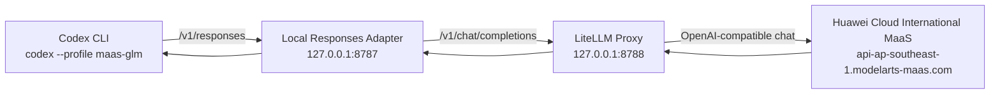

# Using Huawei Cloud MaaS Models in Codex

This guide explains how to use Huawei Cloud International MaaS models in Codex through a local LiteLLM-based proxy.

> Security note: never paste a real API key into documentation, screenshots, Git commits, or shared chat logs. Use environment variables.

---

## 1. Architecture

Codex currently expects an OpenAI-compatible `Responses API` endpoint for custom providers. Huawei Cloud MaaS provides an OpenAI-compatible `chat/completions` endpoint. This project bridges that protocol gap locally.



Runtime ports:

| Component | Port | Purpose |
|---|---:|---|
| Responses Adapter | `8787` | Codex-facing OpenAI-compatible `/v1/responses` endpoint |
| LiteLLM Proxy | `8788` | Internal OpenAI-compatible `/v1/chat/completions` proxy |

---

## 2. Files

Project directory:

```text
/Users/jasonhuang/maas-codex-litellm
```

Important files:

```text
maas-codex-litellm/
├── litellm_config.yaml      # Maps glm-5.1 to Huawei Cloud MaaS through LiteLLM
├── responses_adapter.py     # Converts Codex Responses requests to chat/completions
├── scripts/
│   ├── start.sh             # Starts LiteLLM on 8788 and adapter on 8787
│   └── verify.py            # Verifies chat, responses, and streaming responses
└── README.md
```

Codex config:

```toml
[profiles.maas-glm]
model = "glm-5.1"
model_provider = "huawei-maas-proxy"
model_context_window = 128000
model_catalog_json = "/Users/jasonhuang/.codex/glm-model-catalog.json"
model_supports_reasoning_summaries = false

[model_providers.huawei-maas-proxy]
name = "Huawei Cloud MaaS via LiteLLM"
base_url = "http://127.0.0.1:8787/v1"
env_key = "MAAS_API_KEY"
```

---

## 3. Prerequisites

You need:

- A Huawei Cloud International MaaS API key.
- The MaaS model `glm-5.1` enabled for your account.
- Python 3 with the installed LiteLLM proxy dependencies.
- Codex CLI installed and configured.

Installed dependency:

```sh
python3 -m pip install --user 'litellm[proxy]'
```

Huawei Cloud International endpoint:

```text
https://api-ap-southeast-1.modelarts-maas.com/openai/v1
```

---

## 4. Start the Local Proxy

Open a terminal and run:

```sh
cd /Users/jasonhuang/maas-codex-litellm
export MAAS_API_KEY="YOUR_HUAWEI_CLOUD_MAAS_API_KEY"
./scripts/start.sh
```

Expected startup shape:

```text
LiteLLM Proxy running on http://127.0.0.1:8788
Responses Adapter running on http://127.0.0.1:8787
```

The script automatically uses this MaaS endpoint if `MAAS_API_BASE` is not set:

```text
https://api-ap-southeast-1.modelarts-maas.com/openai/v1
```

Optional explicit endpoint:

```sh
export MAAS_API_BASE="https://api-ap-southeast-1.modelarts-maas.com/openai/v1"
```

---

## 5. Verify the Proxy

Keep the proxy terminal running. Open another terminal and run:

```sh
cd /Users/jasonhuang/maas-codex-litellm
export MAAS_API_KEY="YOUR_HUAWEI_CLOUD_MAAS_API_KEY"
python3 scripts/verify.py
```

Expected result:

```text
base_url=http://127.0.0.1:8787/v1
model=glm-5.1
checking chat.completions...
chat: ok
checking responses...
responses: ok
checking streaming responses...
responses.stream: ok
ok
```

What this proves:

- `/v1/chat/completions` works through the local proxy.
- `/v1/responses` works for Codex.
- Streaming `/v1/responses` works for interactive Codex sessions.

---

## 6. Start Codex with MaaS

Open a new terminal:

```sh
export MAAS_API_KEY="YOUR_HUAWEI_CLOUD_MAAS_API_KEY"
cd /Users/jasonhuang
codex --profile maas-glm
```

The important part is `--profile maas-glm`. That profile tells Codex to use:

```text
model: glm-5.1
provider: huawei-maas-proxy
base_url: http://127.0.0.1:8787/v1
```

Quick non-interactive test:

```sh
export MAAS_API_KEY="YOUR_HUAWEI_CLOUD_MAAS_API_KEY"
codex exec --profile maas-glm --skip-git-repo-check "Reply exactly: ok"
```

Expected output:

```text
ok
```

---

## 7. Terminal Workflow

Use two terminals:

```mermaid
sequenceDiagram
    participant T1 as Terminal 1
    participant T2 as Terminal 2
    participant P as Local Proxy
    participant C as Codex
    participant M as Huawei MaaS

    T1->>P: export MAAS_API_KEY; ./scripts/start.sh
    P->>M: Connect to MaaS chat/completions
    T2->>C: export MAAS_API_KEY; codex --profile maas-glm
    C->>P: /v1/responses
    P->>M: /chat/completions
    M-->>P: model output
    P-->>C: Responses-compatible output
```

Terminal 1: keep the proxy running.

```sh
cd /Users/jasonhuang/maas-codex-litellm
export MAAS_API_KEY="YOUR_HUAWEI_CLOUD_MAAS_API_KEY"
./scripts/start.sh
```

Terminal 2: run Codex.

```sh
export MAAS_API_KEY="YOUR_HUAWEI_CLOUD_MAAS_API_KEY"
cd /Users/jasonhuang
codex --profile maas-glm
```

---

## 8. Troubleshooting

### Check whether the proxy is running

```sh
lsof -nP -iTCP:8787 -sTCP:LISTEN
lsof -nP -iTCP:8788 -sTCP:LISTEN
```

Expected:

```text
Python ... TCP 127.0.0.1:8787 (LISTEN)
Python ... TCP 127.0.0.1:8788 (LISTEN)
```

### Stop the proxy

Find the PIDs:

```sh
lsof -nP -iTCP:8787 -sTCP:LISTEN
lsof -nP -iTCP:8788 -sTCP:LISTEN
```

Then stop them:

```sh
kill <PID_FOR_8787> <PID_FOR_8788>
```

### `MAAS_API_KEY is required`

You started the proxy without setting the API key.

Fix:

```sh
export MAAS_API_KEY="YOUR_HUAWEI_CLOUD_MAAS_API_KEY"
./scripts/start.sh
```

### `/v1/responses` returns 404 from MaaS

That means Codex or your verification script is bypassing the local Responses adapter and calling MaaS directly, or LiteLLM is exposed directly on the Codex-facing port.

Correct layout:

```text
Codex -> 127.0.0.1:8787 -> responses_adapter.py -> 127.0.0.1:8788 -> LiteLLM -> MaaS
```

### LiteLLM guardrail warnings on Python 3.9

You may see optional LiteLLM guardrail warnings like `unsupported operand type(s) for |`. In the tested setup, these warnings do not block the proxy, chat requests, Responses requests, or streaming.

---

## 9. Current Verified Result

The current local setup has been verified with:

```text
chat.completions: ok
responses: ok
responses.stream: ok
codex --profile maas-glm: ok
```

Use this command for daily work:

```sh
codex --profile maas-glm
```
