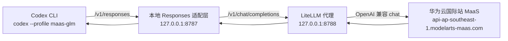

# 在 Codex 中使用华为云 MaaS 模型

本文说明如何通过本地 LiteLLM 代理，在 Codex 中使用华为云国际站 MaaS 模型。

> 安全提醒：不要把真实 API Key 写进文档、截图、Git 提交或共享聊天记录。请使用环境变量。

---

## 1. 架构

Codex 当前自定义 provider 需要 OpenAI 兼容的 `Responses API` 入口。华为云 MaaS 提供的是 OpenAI 兼容的 `chat/completions` 入口。本项目在本机补齐这层协议转换。



运行端口：

| 组件 | 端口 | 用途 |
|---|---:|---|
| Responses 适配层 | `8787` | 面向 Codex 的 OpenAI 兼容 `/v1/responses` 入口 |
| LiteLLM 代理 | `8788` | 内部 OpenAI 兼容 `/v1/chat/completions` 代理 |

---

## 2. 文件说明

项目目录：

```text
/Users/jasonhuang/maas-codex-litellm
```

关键文件：

```text
maas-codex-litellm/
├── litellm_config.yaml      # 通过 LiteLLM 将 glm-5.1 映射到华为云 MaaS
├── responses_adapter.py     # 将 Codex Responses 请求转换为 chat/completions
├── scripts/
│   ├── start.sh             # 启动 8788 上的 LiteLLM 和 8787 上的适配层
│   └── verify.py            # 验证 chat、responses、流式 responses
└── README.md
```

Codex 配置：

```toml
[profiles.maas-glm]
model = "glm-5.1"
model_provider = "huawei-maas-proxy"
model_context_window = 128000
model_catalog_json = "/Users/jasonhuang/.codex/glm-model-catalog.json"
model_supports_reasoning_summaries = false

[model_providers.huawei-maas-proxy]
name = "Huawei Cloud MaaS via LiteLLM"
base_url = "http://127.0.0.1:8787/v1"
env_key = "MAAS_API_KEY"
```

---

## 3. 前置条件

你需要：

- 华为云国际站 MaaS API Key。
- 账号已开通 MaaS 模型 `glm-5.1`。
- Python 3，并已安装 LiteLLM proxy 依赖。
- 已安装并配置 Codex CLI。

已安装依赖：

```sh
python3 -m pip install --user 'litellm[proxy]'
```

华为云国际站接口地址：

```text
https://api-ap-southeast-1.modelarts-maas.com/openai/v1
```

---

## 4. 启动本地代理

打开终端并执行：

```sh
cd /Users/jasonhuang/maas-codex-litellm
export MAAS_API_KEY="YOUR_HUAWEI_CLOUD_MAAS_API_KEY"
./scripts/start.sh
```

预期启动状态：

```text
LiteLLM Proxy running on http://127.0.0.1:8788
Responses Adapter running on http://127.0.0.1:8787
```

如果没有设置 `MAAS_API_BASE`，启动脚本会默认使用：

```text
https://api-ap-southeast-1.modelarts-maas.com/openai/v1
```

也可以显式指定：

```sh
export MAAS_API_BASE="https://api-ap-southeast-1.modelarts-maas.com/openai/v1"
```

---

## 5. 验证代理

保持代理终端运行。另开一个终端执行：

```sh
cd /Users/jasonhuang/maas-codex-litellm
export MAAS_API_KEY="YOUR_HUAWEI_CLOUD_MAAS_API_KEY"
python3 scripts/verify.py
```

预期结果：

```text
base_url=http://127.0.0.1:8787/v1
model=glm-5.1
checking chat.completions...
chat: ok
checking responses...
responses: ok
checking streaming responses...
responses.stream: ok
ok
```

这说明：

- 本地代理的 `/v1/chat/completions` 可用。
- Codex 需要的 `/v1/responses` 可用。
- 交互式 Codex 会话需要的流式 `/v1/responses` 可用。

---

## 6. 使用 MaaS 启动 Codex

打开新的终端：

```sh
export MAAS_API_KEY="YOUR_HUAWEI_CLOUD_MAAS_API_KEY"
cd /Users/jasonhuang
codex --profile maas-glm
```

关键参数是 `--profile maas-glm`。这个 profile 会让 Codex 使用：

```text
model: glm-5.1
provider: huawei-maas-proxy
base_url: http://127.0.0.1:8787/v1
```

快速非交互测试：

```sh
export MAAS_API_KEY="YOUR_HUAWEI_CLOUD_MAAS_API_KEY"
codex exec --profile maas-glm --skip-git-repo-check "Reply exactly: ok"
```

预期输出：

```text
ok
```

---

## 7. 推荐终端工作流

建议使用两个终端：

```mermaid
sequenceDiagram
    participant T1 as 终端 1
    participant T2 as 终端 2
    participant P as 本地代理
    participant C as Codex
    participant M as 华为云 MaaS

    T1->>P: export MAAS_API_KEY; ./scripts/start.sh
    P->>M: 连接 MaaS chat/completions
    T2->>C: export MAAS_API_KEY; codex --profile maas-glm
    C->>P: /v1/responses
    P->>M: /chat/completions
    M-->>P: 模型输出
    P-->>C: Responses 兼容输出
```

终端 1：保持代理运行。

```sh
cd /Users/jasonhuang/maas-codex-litellm
export MAAS_API_KEY="YOUR_HUAWEI_CLOUD_MAAS_API_KEY"
./scripts/start.sh
```

终端 2：运行 Codex。

```sh
export MAAS_API_KEY="YOUR_HUAWEI_CLOUD_MAAS_API_KEY"
cd /Users/jasonhuang
codex --profile maas-glm
```

---

## 8. 故障排查

### 检查代理是否运行

```sh
lsof -nP -iTCP:8787 -sTCP:LISTEN
lsof -nP -iTCP:8788 -sTCP:LISTEN
```

预期：

```text
Python ... TCP 127.0.0.1:8787 (LISTEN)
Python ... TCP 127.0.0.1:8788 (LISTEN)
```

### 停止代理

找到进程 ID：

```sh
lsof -nP -iTCP:8787 -sTCP:LISTEN
lsof -nP -iTCP:8788 -sTCP:LISTEN
```

然后停止：

```sh
kill <PID_FOR_8787> <PID_FOR_8788>
```

### `MAAS_API_KEY is required`

说明启动代理前没有设置 API key。

修复：

```sh
export MAAS_API_KEY="YOUR_HUAWEI_CLOUD_MAAS_API_KEY"
./scripts/start.sh
```

### `/v1/responses` 返回 MaaS 404

这表示 Codex 或验证脚本绕过了本地 Responses 适配层，直接调用了 MaaS，或者 LiteLLM 被直接暴露到了 Codex 使用的端口。

正确布局：

```text
Codex -> 127.0.0.1:8787 -> responses_adapter.py -> 127.0.0.1:8788 -> LiteLLM -> MaaS
```

### Python 3.9 上的 LiteLLM guardrail 警告

在 Python 3.9 上可能看到 LiteLLM 可选 guardrail 模块的 `unsupported operand type(s) for |` 警告。当前实测中，这些警告不影响代理启动、chat 请求、Responses 请求或流式响应。

---

## 9. 当前已验证结果

当前本地配置已验证：

```text
chat.completions: ok
responses: ok
responses.stream: ok
codex --profile maas-glm: ok
```

日常使用命令：

```sh
codex --profile maas-glm
```
